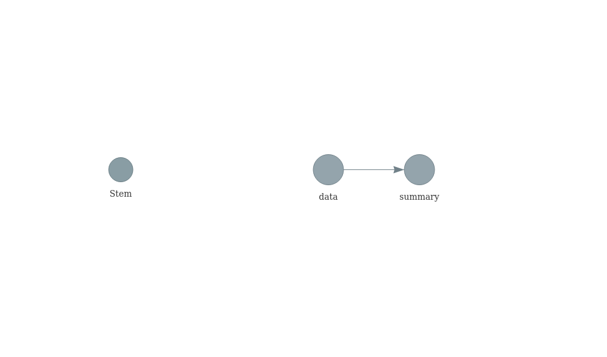
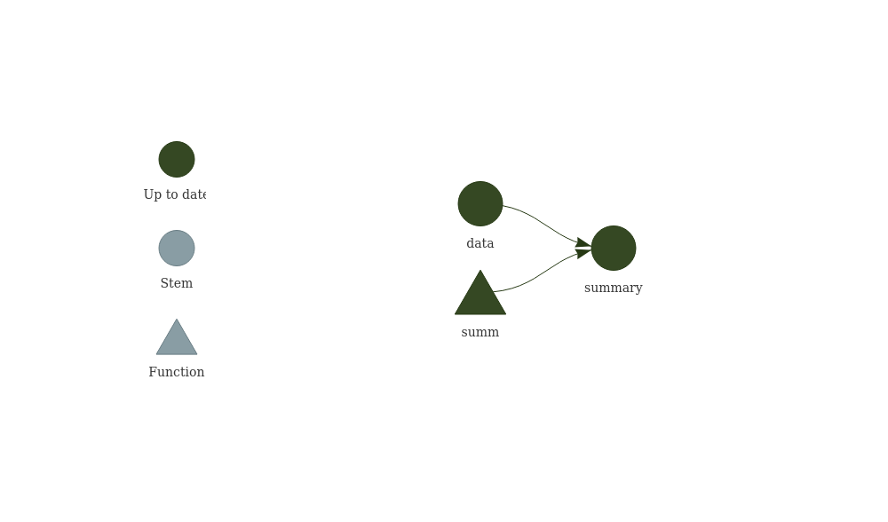

<!-- README.md is generated from README.Rmd. Please edit that file -->

# Walkthrough

Use targets.

``` r
library(targets)
```

Write a \_targets.R script to the current working directory.

``` r
tar_script()
```

Helper.

``` r
show <- function(path) {
  lines <- readLines(here::here(path))
  header <- paste("\n#", path)
  out <- writeLines(c(header, lines))
  out
}
```

Show contents.

``` r
show("_targets.R")

# _targets.R
library(targets)
# This is an example _targets.R file. Every
# {targets} pipeline needs one.
# Use tar_script() to create _targets.R and tar_edit()
# to open it again for editing.
# Then, run tar_make() to run the pipeline
# and tar_read(summary) to view the results.

# Define custom functions and other global objects.
# This is where you write source(\"R/functions.R\")
# if you keep your functions in external scripts.
summ <- function(dataset) {
  summarize(dataset, mean_x = mean(x))
}

# Set target-specific options such as packages.
tar_option_set(packages = "dplyr")

# End this file with a list of target objects.
list(
  tar_target(data, data.frame(x = sample.int(100), y = sample.int(100))),
  tar_target(summary, summ(data)) # Call your custom functions as needed.
)
NULL
```

Open \_targets.R for editing.

``` r
tar_edit()
```

Run a pipeline of targets.

``` r
tar_make()
```

Visualize an abridged fast dependency graph.

``` r
tar_visnetwork()
```

<!-- -->

Use the targets we have just made, e.g. to report your analysis results.

``` r
tar_objects()
#> [1] "data"    "summary"

data <- tar_read(data)
head(data)
#>    x  y
#> 1 73 78
#> 2 24 93
#> 3 15 31
#> 4  4 67
#> 5 86 40
#> 6 64 34

tar_read(summary)
#>   mean_x
#> 1   50.5

plot(data)
```

<!-- -->
