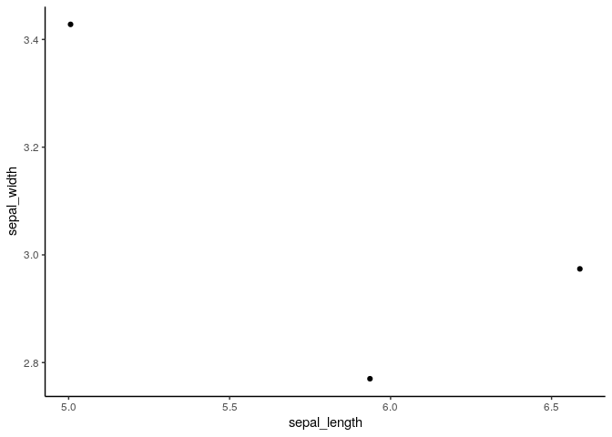

``` r
# Analyze a dataset: Clean it and summarize and plot the mean values of numeric
# variebles, optionally by groups.

# Setup -------------------------------------------------------------------

r_path <- function(...) here::here(...)
source(r_path("01_packages.R"))
source(r_path("02_functions.R"))

# Parameters --------------------------------------------------------------

(dataset <- params$dataset)
#> [1] "http://bit.ly/iris_tsv"
(groups <- params$groups)
#> [1] "species"
(axes <- params$axes)
#> [1] "sepal_length" "sepal_width"
(facets <- params$facets)
#> NULL

# Data --------------------------------------------------------------------

(raw <- vroom(dataset, col_types = cols()))
#> # A tibble: 150 x 5
#>    Sepal.Length Sepal.Width Petal.Length Petal.Width Species
#>           <dbl>       <dbl>        <dbl>       <dbl> <chr>  
#>  1          5.1         3.5          1.4         0.2 setosa 
#>  2          4.9         3            1.4         0.2 setosa 
#>  3          4.7         3.2          1.3         0.2 setosa 
#>  4          4.6         3.1          1.5         0.2 setosa 
#>  5          5           3.6          1.4         0.2 setosa 
#>  6          5.4         3.9          1.7         0.4 setosa 
#>  7          4.6         3.4          1.4         0.3 setosa 
#>  8          5           3.4          1.5         0.2 setosa 
#>  9          4.4         2.9          1.4         0.2 setosa 
#> 10          4.9         3.1          1.5         0.1 setosa 
#> # … with 140 more rows

# Analysis ----------------------------------------------------------------

(prep <- raw %>% prepare())
#> # A tibble: 150 x 5
#>    sepal_length sepal_width petal_length petal_width species
#>           <dbl>       <dbl>        <dbl>       <dbl> <chr>  
#>  1          5.1         3.5          1.4         0.2 setosa 
#>  2          4.9         3            1.4         0.2 setosa 
#>  3          4.7         3.2          1.3         0.2 setosa 
#>  4          4.6         3.1          1.5         0.2 setosa 
#>  5          5           3.6          1.4         0.2 setosa 
#>  6          5.4         3.9          1.7         0.4 setosa 
#>  7          4.6         3.4          1.4         0.3 setosa 
#>  8          5           3.4          1.5         0.2 setosa 
#>  9          4.4         2.9          1.4         0.2 setosa 
#> 10          4.9         3.1          1.5         0.1 setosa 
#> # … with 140 more rows

(means <- prep %>% mean_of_numerics(groups))
#> # A tibble: 3 x 5
#>   species    sepal_length sepal_width petal_length petal_width
#> * <chr>             <dbl>       <dbl>        <dbl>       <dbl>
#> 1 setosa             5.01        3.43         1.46       0.246
#> 2 versicolor         5.94        2.77         4.26       1.33 
#> 3 virginica          6.59        2.97         5.55       2.03

means %>% plot_xy(axes, by = facets)
```

<!-- -->
