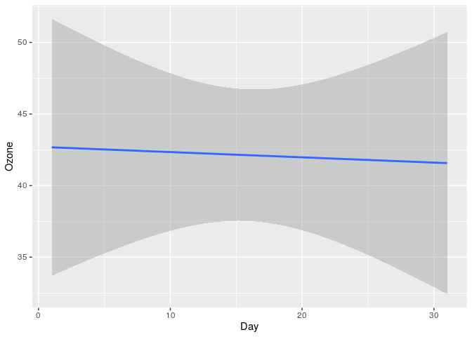

> The bulk of the computation should have already happened upstream, and
> the most of the code chunks in the report itself should be terse calls
> to tar\_read() and tar\_load().

–<https://books.ropensci.org/targets/files.html#literate-programming>

### Setup

    library(targets)
    library(ggplot2)

### Introduction

This report summarizes our results, mostly as terse calls to
`tar_read()`. For implementation details, see the underlying targets
pipeline:

    writeLines(readLines("_targets.R"))
    #> library(targets)
    #> library(tarchetypes)
    #> 
    #> options(TZ="Germany/Berlin")
    #> tar_option_set(imports = "ds.targets", packages = c("ds.targets", "tidyverse"))
    #> 
    #> list(
    #>   # External
    #>   tar_target(path, raw_path(), format = "file"),
    #>   # Internal: _targets/objects/
    #>   tar_target(raw, command = read(path)),
    #>   tar_target(data, clean(raw)),
    #>   tar_target(model, linear_model(data)),
    #>   # External
    #>   tar_render(lm, "lm.Rmd", output_format = "md_document"),
    #>   tar_render(plot, "plot.Rmd", output_format = "md_document")
    #> )

### Methods

To make this project easy to reproduce and share we built the R package
[ds.targets](https://github.com/2DegreesInvesting/ds-targets). You can
install it from GitHub with:

    # install.packages("devtools")
    devtools::install_github("2DegreesInvesting/ds.targets")

To clean the raw data we removed observations where `Ozone` values were
missing.

    # Source code
    ds.targets::clean
    #> function(raw) {
    #>   dplyr::mutate(
    #>     raw,
    #>     Ozone = tidyr::replace_na(.data$Ozone, mean(.data$Ozone, na.rm = TRUE))
    #>   )
    #> }
    #> <bytecode: 0x49ab708>
    #> <environment: namespace:ds.targets>

    # Before
    raw_data <- tar_read(raw)
    any(is.na(raw_data$Ozone))
    #> [1] TRUE

    # After
    clean_data <- tar_read(data)
    any(is.na(clean_data$Ozone))
    #> [1] FALSE

To explored changes in `Ozone` through time we use a linear model.

### Results

Here are our results:

    ggplot(clean_data, aes(Day, Ozone)) + geom_smooth(method = "lm")
    #> `geom_smooth()` using formula 'y ~ x'

### Conclusion

We see no evidence that Ozone changes through time.
